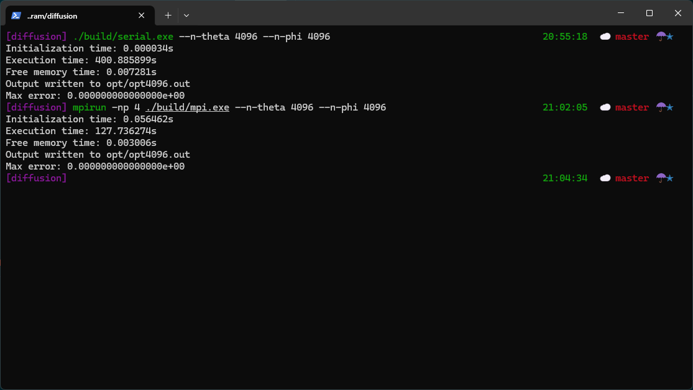

# Diffusion MPI Parallel

**A C++ MPI/OpenMP implementation of spherical diffusion solver**  
This project parallelizes a finite-difference spherical diffusion simulation using MPI and OpenMP. It includes:

- Reference serial code (`mainSerial.cpp`)  
- Optimized MPI version (`mainMPI.cpp`, `DiffusionSolverMPI.cpp`)  
- Utility tools for correctness checks
- Support for benchmarking, trace logs, and regression detection

---

## Building

```bash
make clean
make ref     # builds reference results
make run     # builds mpi and run tests
```

---

## Running

### Serial (single-process)
```bash
./build/serial.exe --n-theta 4096 --n-phi 4096
```

### MPI (4 processes)
```bash
mpirun -np 4 ./build/mpi.exe --n-theta 4096 --n-phi 4096
```
Or, on a SLURM cluster:
```bash
sbatch sbatch/mpi.sbatch 4096
```

---

## Performance Evaluation

**On local machine:**
| Grid Size | Serial Time (s) | MPI Time (4‑proc, s) | Speedup |
|:---------:|:---------------:|:---------------------:|:-------:|
| 256       | 1.255637        | 0.348405              | 3.60×   |
| 512       | 5.692289        | 1.435501              | 3.97×   |
| 1024      | 23.678976       | 6.741466              | 3.51×   |
| 2048      | 95.939087       | 31.807867             | 3.02×   |
| 4096      | 396.180147      | 129.313484            | 3.06×   |

Demo:



Local machine setup:
```
OS: Gentoo Linux on Windows 10 x86_64
Kernel: 5.15.167.4-microsoft-standard-WSL2
CPU: Intel Ultra 5 225H (4) @ 3.686GHz
GPU: 57ba:00:00.0 Microsoft Corporation Basic Render Driver
```

Output files are upload by **git-lfs** in `ref/` and `opt/`.
**Make sure to have `git-lfs` installed before pulling**!

4096 results are not included due to LFS size limit.

---

**On remote cluster:**

Didn't succeed. Killed due to:
```
===================================================================================
=   BAD TERMINATION OF ONE OF YOUR APPLICATION PROCESSES
=   RANK 1 PID 2757065 RUNNING AT qhcn221
=   KILLED BY SIGNAL: 9 (Killed)
===================================================================================

===================================================================================
=   BAD TERMINATION OF ONE OF YOUR APPLICATION PROCESSES
=   RANK 2 PID 2757066 RUNNING AT qhcn221
=   KILLED BY SIGNAL: 9 (Killed)
===================================================================================

===================================================================================
=   BAD TERMINATION OF ONE OF YOUR APPLICATION PROCESSES
=   RANK 3 PID 2757067 RUNNING AT qhcn221
=   KILLED BY SIGNAL: 9 (Killed)
===================================================================================

===================================================================================
=   BAD TERMINATION OF ONE OF YOUR APPLICATION PROCESSES
=   RANK 4 PID 2757068 RUNNING AT qhcn221
=   KILLED BY SIGNAL: 9 (Killed)
===================================================================================

===================================================================================
=   BAD TERMINATION OF ONE OF YOUR APPLICATION PROCESSES
=   RANK 5 PID 2757069 RUNNING AT qhcn221
=   KILLED BY SIGNAL: 9 (Killed)
===================================================================================

===================================================================================
=   BAD TERMINATION OF ONE OF YOUR APPLICATION PROCESSES
=   RANK 6 PID 2757070 RUNNING AT qhcn221
=   KILLED BY SIGNAL: 9 (Killed)
===================================================================================

===================================================================================
=   BAD TERMINATION OF ONE OF YOUR APPLICATION PROCESSES
=   RANK 7 PID 2757071 RUNNING AT qhcn221
=   KILLED BY SIGNAL: 9 (Killed)
==============================================================
```

Still couldn't figure out why.
